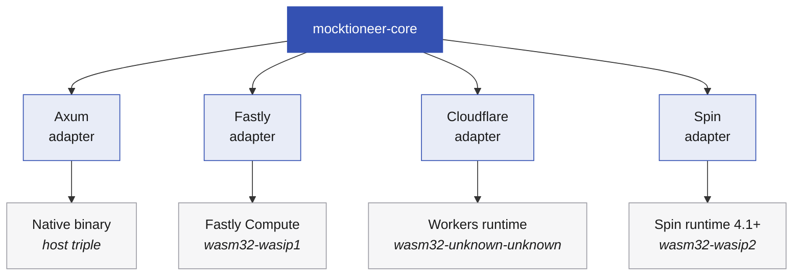

# Adapters Overview

Mocktioneer runs on multiple edge platforms through the adapter pattern. Each adapter translates platform-specific request/response formats to the common EdgeZero interface.

## Available Adapters

| Adapter                               | Platform           | Use Case                               |
| ------------------------------------- | ------------------ | -------------------------------------- |
| [Axum](./axum)                        | Native Rust        | Local development, integration testing |
| [Fastly](./fastly)                    | Fastly Compute     | Production edge deployment             |
| [Cloudflare](./cloudflare)            | Cloudflare Workers | Production edge deployment             |
| [Spin](../configuration#spin-adapter) | Spin / Fermyon     | Production edge deployment             |

Spin requires a Spin 4.1+ runtime; see [its configuration
notes](../configuration#spin-adapter) for the reason and the setup.

## How Adapters Work

All adapters share the same core logic from `mocktioneer-core`. The adapter layer handles:

1. **Request translation** - Convert platform-specific requests to EdgeZero format
2. **Response translation** - Convert EdgeZero responses to platform format
3. **Runtime initialization** - Set up logging, configuration
4. **Platform features** - Access platform-specific APIs (KV stores, etc.)



## Choosing an Adapter

### For Development

Use the **Axum adapter**:

- Fastest compile times (native target)
- Standard Rust debugging
- No platform CLI required

```bash
cargo run -p mocktioneer-adapter-axum
```

### For Production

Choose based on your infrastructure:

- **Fastly Compute** - If you're already using Fastly or need their edge network
- **Cloudflare Workers** - If you're already using Cloudflare or prefer their platform
- **Spin / Fermyon** - If you're running Spin; needs a 4.1+ runtime

All three provide:

- Global edge deployment
- Low latency
- Automatic scaling

## EdgeZero CLI

The EdgeZero CLI provides a unified interface for all adapters. It's maintained in the EdgeZero repository and isn't vendored here, so install it separately if you want to use it.

```bash
# Install (requires access to EdgeZero repo)
cargo install --git https://github.com/stackpop/edgezero.git edgezero-cli --features cli

# Serve any adapter
edgezero-cli serve --adapter axum
edgezero-cli serve --adapter fastly
edgezero-cli serve --adapter cloudflare
edgezero-cli serve --adapter spin        # needs a Spin 4.1+ runtime

# Build any adapter
edgezero-cli build --adapter fastly
```

The CLI reads `edgezero.toml` and executes the appropriate commands for each adapter.
If you don't have `edgezero-cli`, use the direct adapter commands on the pages below.

### In-repo `mocktioneer-cli`

This repository also vendors a thin `mocktioneer-cli` built on the EdgeZero CLI
library — no separate install needed:

```bash
# serve / build / deploy (same as edgezero-cli)
cargo run -p mocktioneer-cli -- serve --adapter cloudflare

# typed config (lives only here — validated against MocktioneerConfig)
cp mocktioneer.toml.example mocktioneer.toml       # gitignored per-env copy
cargo run -p mocktioneer-cli -- config validate --strict
cargo run -p mocktioneer-cli -- config diff --adapter axum
cargo run -p mocktioneer-cli -- config push --adapter axum --yes
```

`serve`/`build`/`deploy`/`auth`/`provision` work from either the external
`edgezero-cli` or `mocktioneer-cli`; the typed `config validate` / `config diff` /
`config push` commands are only in `mocktioneer-cli`.

## Common Configuration

All adapters read from the same `edgezero.toml`:

- Routes are identical across platforms
- Middleware is applied consistently
- Logging levels are configurable per-adapter

See [Configuration](../configuration) for details.
